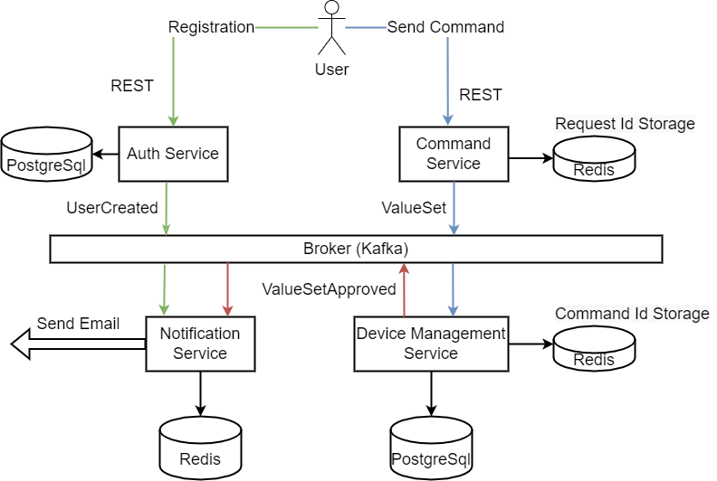

# 1. Развертывание
    helm dependency update
    helm -n auth upgrade --install --create-namespace app .
Манифесты развертываются в namespace auth

# 2. Проверка
## Выполнить Postman Collection для приведенного выше сценария
    newman run --insecure Idempotency.postman_collection.json

# 3. Event Collaboration

# 4. Решение
Для идемпотентности и коммутативности запросов используем следующие решения:
## 1. Ключ идемпотентности X-Request-Id
Пользователь отправляет вместе с командой хедер X-Request-Id с уникальным идентификатором. 
Command Service проверяет, есть ли запрос с указанным X-Request-Id в списке обработанных. 
Если нет, сервис отправляет запрос дальше и заносит идентификатор X-Request-Id в список обработанных.
## 2. Idempotent Receiver
Command Service в каждую полученную команду добавляет уникальный идентификатор сообщения (messageId) и передает команду дальше.
Сервис Device Management перед применением команды проверяет текущую команду в списке уже обработанных по messageId. 
Если данной команды там нет, сервис применяет команду и заносит messageId в список обработанных.
## 3. Compare And Set
При отправке команды добавление значения параметра (к текущему значению) пользователь также отправляет старое значение параметра.
В сервисе Device Management перед применением команды сравнивается старое значение отправленное пользователем и текущее значение параметра в БД.

## Список компонентов:
1. Api Gateway (Nginx Controller + Oauth2 proxy) - аутентификация пользователей для доступа к приложению Myapp.
2. Auth Service - сервер аутентификации/авторизации/регистрации пользователей.
3. Oauth2-proxy позволяет использовать внешний сервис аутентификации/авторизации (Auth Service) для доступа к защищенным ресурсам.
4. Command Service - сервис для отправки команд на устройство.
5. Device Management Service - сервис управления устройствами. Содержит список устройств и их сенсоров. 
Каждое устройство может содержать несколько сенсоров - каждому из них соответствует один параметр, который он измеряет (temperature, humidity и тд).
Также сервис хранит список пользователей и групп, которым разрешен доступ к определенным группам устройств.
6. Notification Service - сервис уведомлений. Занимается отправкой уведомлений пользователям при возникновении каких-либо событий. Также хранит список уведомлений в своей БД.

## Сценарий использования (описан в Postman Collection)
1. Пользователь регистрируется в **Auth Service**. 
Auth Service отправляет событие о создании пользователя, на которое подписан **Device Management Service**. 
**Device Management Service** создает аккаунт пользователя с возможностью создания тестовых устройств и управления ими.
2. Пользователь делает login.
3. Пользователь создает в **Device Management Service** устройство с сенсором.
4. Пользователь отправляет команду на установку значения параметра temperature для сенсора устройства.
5. Получаем текущее значение параметра и убеждаемся что значение изменилось.
6. Пользователь отправляет команду на добавление значения параметра temperature для сенсора устройства. В команде также указываем старое значение.
7. Получаем текущее значение параметра и убеждаемся что значение изменилось.
8. Пользователь отправляет команду на добавление значения параметра temperature для сенсора устройства. В команде также указываем старое значение. 
   В данном запросе указываем RequestId такой же, как в предыдущем запросе.
Получаем текущее значение параметра и убеждаемся что значение не изменилось.
9. Пользователь отправляет команду на добавление значения параметра temperature для сенсора устройства. В команде также указываем некорректное старое значение.
10. Получаем текущее значение параметра и убеждаемся что значение не изменилось.
11. Пользователь делает logout.

# Удаление развернутых ресурсов
    helm -n auth delete app 
    kubectl delete pvc --all -n auth
    kubectl delete pv --all -n auth
    kubectl delete namespace auth

Домашнее задание/проектная работа разработано(-на) для курса [Microservice Architecture](https://otus.ru/lessons/microservice-architecture)
